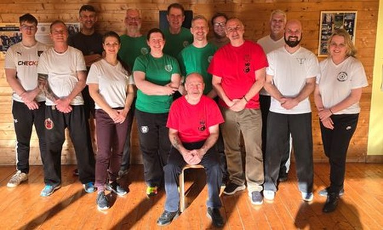

# Welcome to 
#### The Homepage of
#### Integrated KunTao
#### A Martial Art System comprised of three ancient martial arts
&emsp;
### Tai Chi Chuan - Wing Chun - Escrima

&emsp;

Head of the system [Master Ricky Crofts](ricky).

Originally founded and developed by [GM Brian Jones](brian), 

About BJIKTS [Brian Jones Integrated Kun Tao System](about). 

&emsp;

#### **Who we are...**

 A family of like-minded practisioners with all sorts of backgrounds, united under the idea of Integrating and studying Martial Arts, Health and well-being.

