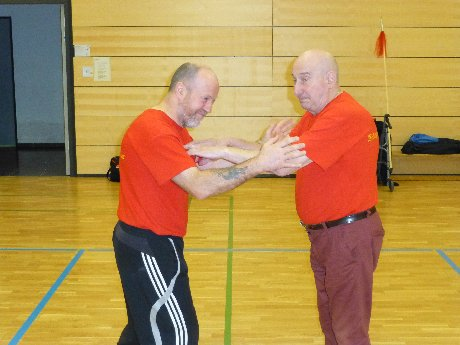
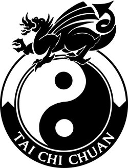
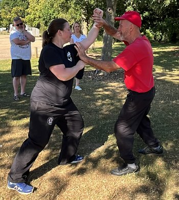
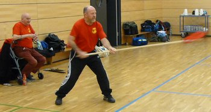
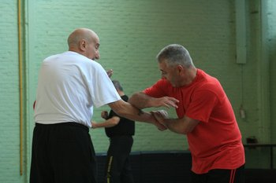
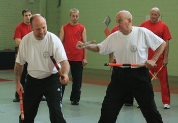
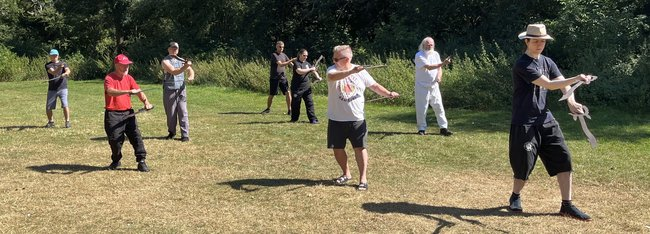
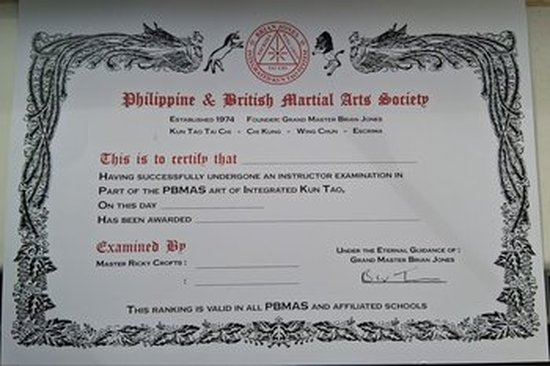
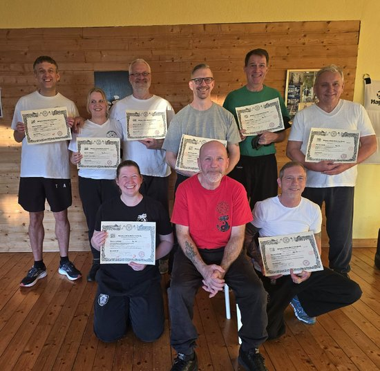

# About

It was Brian’s vision to combine and blend all the different techniques and 
concepts of the various styles he’d learned into the creation of a blended 
system of ‘Chinese Boxing’, 

later adding also Escrima into the mix, being the first in the UK to train, teach and promote Escrima.

GM Brian kept teaching this evolved Fighting style which eventually  became the "Brian Jones Integrated Kun Tao System".

 
 
 

# **Kun Tao Tai Chi Chuan**

Is a Malaysian variation of the Long Form of the Yang Family, as it
was taught by the late GM Leong Fu and our late GM Brian Jones.

108 moves on the right side, then on the left hand side which balances the body

Endless River: both sides at the same time

Two Person Set that employs the 316 applications of Kun Tao Tai Chi Chuan

Joint Hand Operations, fixed steps (Ting Pu Tui Chou)

Joint Hand Operations, active steps (Huo Pu Tui Chou)

Five Steps and Entrances of Kun Tao Tai Chi (Ta Lu - four corner exercise)

 

This is followed by the Kun Tao Tai Chi Chuan Weapons

Narrow Sword (Fan optional for women)

Broad Sword

Spear

# **Wing Chun** 

Is the system as it was taught to GM Brian by GM Wong Waichung / Greco Wong. 

Additionally influences from the unarmed side of Escrima (Kadena de mano) have been implemented as part of the complete Integrated Kun Tao System.

The Traditional Wing Chun Syllabus comprises of:

Three solo person forms:

Siu Lum Tao (Little Idea Form),
Cham Kiu (Spanning the Bridge) and
Biu Ji (Flying Fingers)

Three sets of sticking hands:

Dahn Chi (Single Hand Sparing),
Lap Sau (Warding Off Hands) and
Chi Sau (Double Sticking Hands)

Weapons:

Six by One Long Pole and
Butterfly Knives

There are also Wooden Dummy Techniques unique to the Wing Chun System.

# **Escrima** 

Is a Filipino Martial Art with focus on weapons such as sticks, machettes and knives, as it was taught by GM Rene Latosa

The Latosa system is simple and direct, it revolves around five strikes. 

The five strikes gives the basis for all attacks and defences, combined with triangle footwork and eliptial motion of movements.

The system is taught in 12 student grades alongside a form. The form is GM Brian's contribution to the latosa system.

# **Integrated Kun Tao** 

Has additional forms and techniques that GM Brian developed such as:

An unarmed two person set which integrates all three arts.

Two forms specially designed for the Kuntao knives

Basic self-defence techniques

Wild goose Chi Kung

Black Tiger Form

and more...

# **Grading**

Gradings are optional and/or awarded on merit and dedication.

