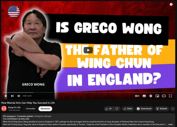

# Our Founding father GM Brian Jones †

Brian Jones was born in Dalston, East London on the 23rd of January 1939 and passed away surrounded by his loved ones on the 25th of February 2019 in Peterborough.

A British Martial Arts pioneer, holding black belts in Judo, Karate, Kun Tao Tai Qi, Black Tiger KungFu, Wing Chun and Escrima. Studying and practising various Martial Arts, eventually combining them in his own System, BJIKTS (Brian Jones Integrated Kun Tao System).

Father of Escrima in the UK.
The first non occidental to learn Wing Chun in UK and maybe Europe.
One of the few Westerners to teach the practical applications of Tai Chi, thus preserving its original purpose as a martial art.

&emsp;

# Extended Biography of Brian Jones, his teachers and Masters

&emsp;

**Judo & Karate**

Brian started martial arts at the age of eleven with Judo under the late Sensei Fugi, eventually achieving his black belt. 

Afterwards he took up a new challenge and began studying Wado-Ryu Karate under the Japanese professor Tatsuo Suzuki, earning his black belt in this discipline too.

*Tatsuo Suzuki was an 8th Dan Japanese karateka instrumental in spreading the martial art of Wadō-ryū karate to Europe and the United States. From 1956–1964, Suzuki formed the first Wado-Ryu Federation in England and from his base in London expanded throughout Europe.*

&emsp;

**Kun Tao Tai Qi**

Brian became exposed to other forms of martial arts, such as Kun Tao Tai Qi (a Malay style of tai chi) when he was serving with the British Army in Malaya, studying under the late GrandMaster Leong Fu.

*"Leong Fu, born in Malaysia of Chinese Parents, was from an early age instructed in Judo and Chinese Boxing. He became proficient in Kung Fu styles under the guidance of local monks. Before long he was hailed as an infant prodigy in these fighting arts and by the time he was twelve he was giving regular exhibitions against opponents twice his own weight and size. Eventually becoming an acomplished wrestler in international tournaments."*

*"Ricky had it verified around 2005 from an ex special forces mans son in law. Who said that Dr Leong Fu skills, energy and strength were phenomenal (eyes very high in martial skills)."*

*"From his learning of different martial styles, Leong Fu developed a system for western servicemen stationed in the Far East after WW2, a few of whom became instructors."*

*"Aside from his own system of Karato Atado, Leong Fu also taught Elephant Fist (Malaysian variant of Northern Eagle Claw) and Kun Tao Tai Chi known as the 'Royal' system, which was a form of Yang Tai Chi that still retained the influence of the combat oriented Chen Style Tai Chi."*

&emsp;

**Wing Chun**

When Brian returned to civilian life he was already a well-rounded martial artist, but by chance he met his next teacher whilst walking past a Chinese restaurant, near London’s Drury lane. He saw a young man performing intriguing techniques from an unknown martial art. He walked over to him and asked what he was doing, but the man simply turned around and disappeared into the restaurant.

But after seeing these ‘strange’ moves, they remained embedded in his mind. In the meanwhile Brian had achieved his Second degree in Wado-Ryu and was still training Judo, Tai Chi and Kuntao, but he had been captivated by the flowing movements he’d seen and so Brian returned to the restaurant and sought out the young man he had seen performing before.

Again, the man refused to engage in conversation with Brian and left the room, but as stubborn as Brian could be, he followed the man downstairs into the cellar, where he unexpectedly saw a group of Chinese men training in this strange martial art.

Bravely, he asked if he could join in and be instructed but was quickly informed that he was not welcome and they didn’t teach westerners, although the young men did introduce himself as Greco Wong, a student of the Grandmaster of Wing Chun Kung Fu Yip Man in Hong Kong.

But Brian didn’t take no for an answer and kept going back to the restaurant for many weeks, until finally Wong agreed to show him some moves. From then on Brian became a regular student in these ‘hidden and secret’ basement classes, with that he became the first English student to be taught the system of Wing Chun in Great Britain.

Greco Wong, the father of Wing Chun in England.

&emsp;

What had attracted Brian the most about Wing Chun had been its mix of hard and soft (internal and external) techniques and principles. However, having been training martial arts for many years, Brian realised that no one system had the answers for perfecting one’s ability to defend himself. Realising that fact made him decide, after four years studying with Greco, to start teaching students in private and eventually opening his own club, at first teaching solely the Wing Chun system, Brian and his top students would get involved in ‘no-holds-barred’ fights to test out what worked under pressure in real fights. In this way Brian polished his evolving fighting style, adding karate kicks and Judo throws to the Wing Chun base and even elements of Kun Tao Tai Qi, this made him rename his style into ‘Chinese Boxing Club’.

&emsp;

**Escrima**

After years of training in this blended system of ‘Chinese Boxing’, Brian and his top Students like Bill Newman, Jay Dobrin and Gary Cornwall would undergo again a big change of direction when one night in 1975 a young man entered their dojo and changed their perception of what really worked in a fight.

This man was Rene Latosa and he introduced them to the Filipino martial art "Escrima".

*"Rene Latosa started his training at the first Escrima Academy established by Angel Cabales and Maximo Sarmiento in his hometown of Stockton, CA. He had the rare opportunity to not only learn from such greats as Angel and Max but world-renowned instructors such as Leo Giron and Dentoy Revilar. He later studied intensively from his own Father, (who had kept his knowledge secret from his son until he felt was ready to learn), several unique and effective Filipino combat fighting systems. His system would become 'Escrima Concepts' and later 'Latosa Escrima'."*

However, mainly weapons-based, Brian and his students were very impressed with Latosa’s effortless use of sticks, knives, machete or anything close to hand, included the empty hand fighting style ‘Kadena de mano’. After long and intensive training Brian, Bill and Jay would be the first to receive their full instructor-ships in Escrima in Great Britain.

They formed the Philippine Martial Arts Society (PMAS) in 1976, with the aim to propagating the art.

&emsp;

**Integrated**

So Brian’s vision to combine and blend all the different techniques and concepts of the various styles he’d learned into the creation of the ‘Brian Jones Integrated Kun Tao system’ came to a reality.

Grand Master Brian Jones kept teaching his evolved Integrated Kun Tao System comprised of the three main Martial arts Wing Chun/Kadena de mano, Escrima and Tai Chi Chuan up to his dead early 2019.

Three years before his passing, in 2016 he recieved the British Martial Arts Lifetime Achievement Award.

From Brian’s passing onwards his Senior student Master Ricky Crofts is now the head of the system and continues to teach and spread the lifework of our late Grand Master and founder of Integrated Kun Tao.

&emsp;

## GM Brian’s own words:

Since I have been learning Martial Arts for 6 decades now, I decided to spend less time training at my club in Peterborough so I integrated three systems together: Wing Chun, Escrima, and Tai Chi. Now, I only train for one night a week at Tuesdays, but spend two hours a day training at home (which pleases my wife I think).

Kun Tao Tai Chi Chuan is the Malaysian Long Form of the Yang Family, as taught by the late Dr Leung Fu. I teach Kun Tao Tai Chi Chuan in the traditional way, one posture per week.

Wing Chun was introduced into Great Britain in the early sixties by Wong Waichung-Greco Wong. The style was then unknown by the English martial artist.

I started my training under Greco at his Chinese Restaurant in Seven Dials, Covent Garden, where I used to work as a fruit and vegetables porter.

**We were the first club to introduce Escrima into Great Britain in the early 1970’s and we teach the Rene Latosa system. Myself (Brian Jones), Bill Newman and Jay Dobrin were the first fully certified Instructors in his system.**

The form is my contribution to the Latosa system. It ingrains the techniques learnt, which is a great help when you come to take your Instructor grade.

&emsp;

### Brian

&emsp;

# Additional features

&emsp;

#### Weapons

Especially made for use in Integrated Kun Tao, they came into being while having a pint in the Botolph Arms with friends and instructors.

The blade was shaped and sent to us from mainland china by an agricultural firm, to whom we are most indebted. The hilt was then designed by myself (Grand Master Brian Jones), Master Alan Broom and Master Ricky Crofts.

&emsp;

#### My book

is a brief introduction of the techniques and weapons used in three ancient martial arts that I have studied over the last 60 years, and now have integrated into my own system. It is to thank my teachers for the best training a student of martial arts could ever have wanted.

&emsp;

#### My legacy

To name all the students that I have trained since becoming a teacher would be an impossible task. But I will name the ones who have gained notability, and quite rightly too, for they have worked hard and long to gain it:

Grandmaster Bill Newman

Master Gary Cornwall

Master Jay Dobrin

Master Steve Tappin

Master Ricky Crofts

Master Alan Broom †

Master John Morgan

