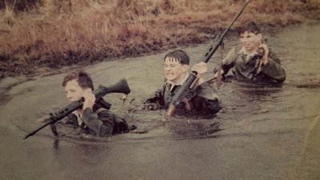
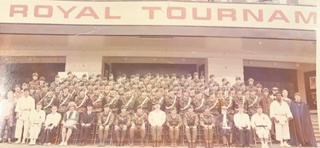

## Ricky:

The martial arts started for me in the early 1970s while at school. Judo and Boxing were first and a good base to build on.
The day after leaving school I joined the Royal Marine Commandos. Over the next decade unarmed combat featured strongly. While in 42 Commando I was in an unarmed combat display team which went around the country and did the royal tournament in 1979 displaying unarmed combat, martial arts and abseiling.
I continued my study of martial arts with Ju-Jitsu, Aikido, Karate, Tae Kwon Do, Kung Fu and Tukido. All studied under good teachers and good friends.
When I left the military in the late 1980s I carried on studying Lau Gar Kung Fu and Kickboxing, reaching Dan and Degree levels in both. It was during this time that I met the most influential teacher and friend in my life, Grandmaster Brian Jones.
It's strange but from our first meeting I knew this was the teacher and arts that I was put on this earth to follow. Brian, I can humbly say, has had the best teachers in the world and certainly does his teachers proud by adhering to their top quality teaching.
Kun Tao Tai Chi was studied first, then came Wing Chun, Escrima, Wild Goose and Black Tiger. After well over 20 years of training under Brian, his teaching is as inspirational, interesting, fun and fresh as my first lesson with my master.

Thank you Brian.

 
 
 
 

## Extended Biography

Tim our friend and website organiser from Belgium has asked me to write an extended autobiography for our site.  Initially my feelings were reticent, as I was brought up old school,  'self praise is no true recommendation.'
On reflection we all need to be in the present moment. 
Being honoured and trusted by Brian to carry the baton of his life's work forward and to keep evolving. I shall do so. 

Born the last day of April 1962 in Newmarket hospital. Given the names Ricky William Crofts by my mum.  My family were farm labourers who moved very regularly due to mechanisation taking over from the hoe and pitch folk.  A dysfunctional Waltons family that travelled like nomads. 
Most of the first 16 years of life were under the guardianship of my grandmother.  She was unknowingly my first martial arts teacher.  A matriarchal overbearing figure (17 stones) from the old school philosophy 'no pain,  no gain.'  If you had an opinion not matching hers or stepped out of line, corporal punishment or verbal chastisement could well follow.  She could punch or strike as well as most men.  So intuitive movement and self defence came instinctive.  I guess the 1960s and 70s functional and dysfunctional parenting for some.

 &emsp; 

In those early school years my recreation and delight was kicking a football every spare moment.  I learnt some boxing, wrestling and weightlifting from a school teacher, friend and good souls Laurie and uncle Bill. 
My first job from 13 to 16 years was a butchers boy for a local butcher Jim.  He had faith in me,  even though the delivery bike with basket was too big for me to touch the ground. 
A good friend David who was a customer on the butcher boy delivery round, would give me books to read on spiritual wisdom and cultures from around the world. It helped me understand that all area's of the world have wonderful wisdom.  He also helped me realise the logic of joining the military.  It made sense,  as I would get paid to travel,  fight and defend myself. 
So after much polite pestering at the military careers office I was given a join up date 11th July 1978. The day after leaving school,  no time to loiter. 

*Whatever appears on life's path, know that within You is a sanctuary and spirit more valuable than all the earthly treasures. 
Just go within to discover an infinite stillness and calm that's always been there!*

 
 

I graduated from Commando training centre, Lympstone 10 months later. Receiving or earning the Commando medal for Commando spirit.
From Lympstone I was posted 42 Commando,  Bickleigh.  After this to Hamworthy barracks,  Poole. Then to Royal Marines Condor, Arbroath, Scotland.  At each posting I trained in various martial arts between overseas deployments. I travelled to 14 countries.  The deployment that influenced my love of martial arts was Hong Kong and the then Chinese border.  Watching people at 4 am enter their gardens to do slow, flowing, calming movements influenced me immensely. My love of Tai Chi Chuan was planted. 
While in 42 Commando  I was part of an unarmed combat, martial arts and abseiling display team. Which travelled the south of England.  Culminating with the military Royal Tournament at Earls Court, London.  A 3 week display,  2 shows a day and 16,000 crowd each show.

When I came out of the  military in the very late 80s I carried on training Lau Gar Kung Fu and kickboxing.  It was during this time,  thanks to a friend also called Tim,  that I met my most influential martial arts teacher Grandmaster Brian. 
After almost 30 years training with Brian,  what lessons and principles have I learnt?

 
 
 
 

## Tai Chi, The Mind and Life

Brian would say,  Tai Chi or Life hinges on the Mind.  The mind is potentially a wonderful Tool.  Divinely given and if functioning from that inner peace which passes all understanding (intuition)can give human beings such potential and creativity.
Like a skillful carpenter,  who is not his or her tools.  We are not our mind.  We are consciousness or awareness.  Our mind is a tool which if used skillfully can be utilised to create beautiful life art.  
A wise carpenter keeps  their hand and electric tools clean,  rust free,  sharp, serviced and oiled.  Likewise our mind should be kept serviced in the moment.  But  for a large amount of our human family,  the mind has built up the rust of a strong egoistic persona. An image or act we project on to the earthly stage.  Individually and collectively.  If we observe human history on this planet it's working is all too evident. 

Like the carpenters electric plane or saw,  the mind tool has developed a major dysfunction.  The on  / off switch is often stuck on or faulty. 
A carpenter often leaves their tools in the workshop.  We carry our mind tool everywhere,  often as a constant voice in the head.  Sometimes a dialogue or conversation in the head.  We say I think! 
However if we observe our thoughts they regularly carry us like a roller coaster or strong wind. 
Unlike a skillful carpenter,  we seldom seem to be able to naturally turn the switch off and stop them.  We blame or criticise others with our faulty tool.  As a poor carpenter blames their tools for unskillful work. 
The egoic mind has created a drama and fiction out of past and future.  Which is seldom the reality of here and now.  

All arts,  crafts and creative hobbies are wonderful gifts to potentially bring the mind home to the inner peace of the present moment. 
To help us become skillful carpenters of the mind tool.  We need to turn it off consciously at the mains.  By skillfully watching as a good mother watches her baby or toddler.  Also by practicing our art or craft we can develop presence and intuition.  

The ego mind will say,  'do it tomorrow.'  Tomorrow never comes,  as it's always today.  
When we become the conscious controller of the mind tool and it's switch.  We become like the skillful carpenter able at will to calm or utilise it when required.  We can then intuitively receive the Sacred plans and Divine drawings from the Supreme Carpenter.  Who is in all space and stillness now.  Constantly creating awe inspiring works of art.  Called Life!

I would like to thank all the wonderful Souls who have appeared on this life's journey.  For teaching me valuable lessons. 

 

*My Commando dagger and Tai Chi narrow sword.  The dagger The epitome of Commando Spirit and narrow sword epitome of Tai Chi. Although different sizes, remarkably similar in shape.*

 
 

Divine Love is recognising your own essence within another and they in you.  The most painful lessons we unconsciously inflict upon our mirrored Souls and ultimately ourselves are often blessings in disguise.  To awaken us to heal and fix our mind switch. 

As Brian said in his book.  'By constant practice of Daoist Yoga (Tai Chi). You will come to understand that Heaven is one's nature,  and earth is one's life.  You cannot help but go forward in the Now. 

 
 

Namaste 🙏